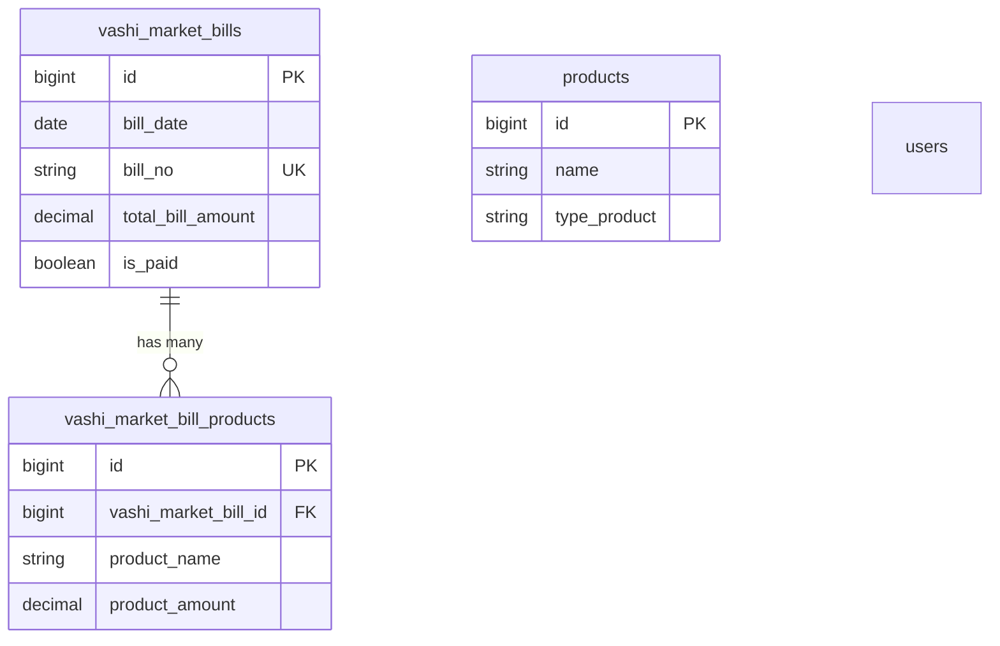

# Sn_Inventory — Santosh Tea Center

Laravel inventory and pricing app with a **Vashi Market bills** module to record wholesale purchases (party, transport, line items) and payment metadata.

**Stack:** Laravel 12, PHP 8.2+, MySQL (typical XAMPP setup), Blade views, session authentication.

---

## Database overview

The schema has two **logical domains**:

1. **Auth & Laravel defaults** — users, sessions, password reset tokens, cache, jobs.
2. **Business data** — master `products` catalog and **Vashi Market** bills with nested line items.

There is **no foreign key** from Vashi line items to `products`. Bill rows store **free-text** `product_name` / `brand_name` (what was on the supplier bill), separate from the internal catalog.

---

## Tables (columns & purpose)

### `users`

| Column | Type | Notes |
|--------|------|--------|
| `id` | bigint PK | |
| `name`, `email`, `password` | string | Standard Laravel migration columns |
| `email_verified_at` | timestamp nullable | |
| `remember_token` | string nullable | |
| `created_at`, `updated_at` | timestamps | |

**Login (actual app behavior):** `UserController@loginStore` looks up users by **`phone_number`** and checks **`pin`** (4 digits), then calls `Auth::login($user)`. If those columns are missing from your database, add a migration for `phone_number` (unique string, 10 digits) and `pin` (string or integer), and extend `$fillable` on `App\Models\User` as needed. The default Laravel `users` migration alone does not define them.

### `password_reset_tokens` / `sessions`

Laravel defaults for password reset and session storage.

### `cache` / `jobs` / `job_batches` / `failed_jobs`

Laravel queue and cache tables (if migrations are present in your install).

### `products` (master catalog — price list / inventory reference)

| Column | Type | Notes |
|--------|------|--------|
| `id` | bigint PK | |
| `name` | string(100) | Product name |
| `purchase_price` | decimal(10,2) | |
| `size_750ml` … `size_15L_jar` | string nullable | Pack sizes (as strings in DB) |
| `type_product` | string nullable | e.g. `grocery`, `oil`, `masala`, `other` — drives grouping on the price list |
| `created_at`, `updated_at` | timestamps | |

**Note:** The `Product` Eloquent model’s `$fillable` may list `brand_name`; if your DB has no `brand_name` column on `products`, add a migration or align the model with the schema.

### `vashi_market_bills` (header — one supplier bill)

| Column | Type | Notes |
|--------|------|--------|
| `id` | bigint PK | |
| `bill_date` | date | Date on bill |
| `received_date` | date | Date goods received |
| `bill_no` | string **unique** | Supplier bill number |
| `party_name` | string | Seller / party |
| `dalal` | string | Broker |
| `transport_name` | string | Transport |
| `total_bill_amount` | decimal(10,2) | Header total |
| `is_paid` | boolean, default false | Paid flag |
| `payment_type` | string nullable | e.g. cash, UPI, cheque |
| `transaction_id` | string nullable | UPI / bank ref |
| `cheque_no` | string nullable | |
| `receipt_no` | string nullable | |
| `paid_date` | date nullable | |
| `paid_amount` | decimal(10,2) nullable | |
| `created_at`, `updated_at` | timestamps | |

Payment fields live on the **same row** as the bill; there is no separate `payments` table.

### `vashi_market_bill_products` (lines — items on that bill)

| Column | Type | Notes |
|--------|------|--------|
| `id` | bigint PK | |
| `vashi_market_bill_id` | FK → `vashi_market_bills.id` | **ON DELETE CASCADE** |
| `product_name` | string | Line description |
| `brand_name` | string nullable | |
| `num_bags` | integer | |
| `bag_size` | decimal(8,2) | |
| `total_kg` | decimal(8,2) | |
| `rate` | decimal(8,2) | Per-kg or unit rate (as entered) |
| `product_amount` | decimal(10,2) | Line amount |
| `created_at`, `updated_at` | timestamps | |

---

## Relationships (ER summary)

- **`VashiMarketBill` → `VashiMarketBillProduct`:** one-to-many (`hasMany` / `belongsTo`).
- **`Product`:** standalone master data; **not** linked to Vashi lines in the database.
- **`User`:** authentication; **not** linked to bills (no `user_id` on bills in current migrations).

---

## Application flow (high level)

1. **Guest** hits `/` → redirect to login.
2. **Login** (`UserController`): validates credentials, starts session (`auth` middleware).
3. **Authenticated** users can:
   - **Price list** — `GET /list/products` (`UserController@showlistofPrice`) — reads `Product` grouped by type/brand.
   - **Products CRUD** — `ProductListController` (create, store, edit, update).
   - **Vashi Market** — full bill lifecycle under `VashiMarketController` (below).

All business routes except login are inside `Route::middleware(['auth'])`.

---

## Vashi Market module — user flow

### 1. List bills

- **URL:** `GET /vashi-market/bills`  
- **Route name:** `vashi-market.index`  
- **Controller:** `VashiMarketController@index`  
- **Behavior:** Loads `VashiMarketBill::with('products')->latest()`. Optional query params:
  - `search` — matches `party_name`, `bill_no`, `bill_date`, or related `products.product_name`
  - `start_date` / `end_date` — filter on `bill_date`  
- **View:** `admin.vashiMarketBillList`

### 2. Create bill (form)

- **URL:** `GET /vashi-market/bills/create`  
- **Route name:** `vashi-market.create`  
- **Controller:** `VashiMarketController@create`  
- **View:** `admin.addVashiMarketBill`

### 3. Store bill (submit)

- **URL:** `POST /vashi-market/bills`  
- **Route name:** `vashi-market.store`  
- **Controller:** `VashiMarketController@store`

**Validation (summary):** header fields + `products[]` array (each line: `product_name`, `brand_name`, `num_bags`, `bag_size`, `total_kg`, `rate`, `product_amount`). `bill_no` must be **globally unique**.

**Persistence:**

1. `DB::transaction`
2. `VashiMarketBill::create(...)` with header + payment fields (`payment_type`, `transaction_id`, `cheque_no`, `receipt_no`, `paid_date`, `paid_amount`, `is_paid` from checkbox `is_paid`)
3. For each row in `products`, `$bill->products()->create($productData)`

**Payment at create:** Payment is **not** a separate step in the current implementation — it is saved together with the bill if the form sends those fields.

On success: `back()` with flash `success`.

### 4. Bill details (read-only view)

- **URL:** `GET /vashi-market/details/{vashiMarketBill}`  
- **Route name:** `vashi-market.showBillDetails`  
- **Controller:** `VashiMarketController@showBillDetails`  
- **Behavior:** Route-model binding + `load('products')`  
- **View:** `admin.showVashiMarketBill` — shows header, payment status, line items.

The **“Update Payment”** button in the view currently has an **empty** `href`; there is no dedicated payment-only screen wired in the Blade file.

### 5. Edit bill

- **URL:** `GET /vashi-market/{id}/edit`  
- **Route name:** `vashi-market.edit`  
- **Controller:** `VashiMarketController@editVashiBill`  
- **View:** `admin.editVashiBill`

### 6. Update bill

- **URL:** `PUT /vashi-market/{id}` (form method spoofing `_method`)  
- **Route name:** `vashi-market.update`  
- **Controller:** `VashiMarketController@updateVashiBill`

**Validation:** Same shape as store, except **`bill_no` is not re-validated as unique** in the update rules (bill number is not in the update payload in the controller — only in create).

**Persistence:**

1. `DB::transaction`
2. `$bill->update(...)` — header + payment fields + `is_paid`
3. `$bill->products()->delete()` — **removes all old lines**
4. Re-create lines from `request->products`

Redirect to `vashi-market.showBillDetails` with success message.

### 7. Dedicated payment route (stub)

- **URL:** `GET /vashi-market/{vashiMarketBill}/payment`  
- **Route name:** `vashi-market.payment.form`  
- **Controller:** `VashiMarketController@showPaymentForm`  

**Current code:** method body is effectively empty (commented return). **No POST route** exists for payment-only updates. In practice, payment is edited via **create** or **update** bill forms.

---

## Controller reference

| Controller | Role |
|------------|------|
| `UserController` | Login, logout, main price list dashboard |
| `ProductListController` | Master `products` create/update |
| `VashiMarketController` | Vashi bills: index, create, store, show details, edit, update; payment route stub |

---

## Route checklist (authenticated)

| Method | URI | Name |
|--------|-----|------|
| GET | `/list/products` | `admin.listofPrice` |
| GET | `/products/create` | `admin.product.create` |
| POST | `/products` | `admin.product.store` |
| GET | `/products/{product}/edit` | `admin.product.edit` |
| PUT | `/products/{product}` | `admin.product.update` |
| GET | `/vashi-market/bills` | `vashi-market.index` |
| GET | `/vashi-market/bills/create` | `vashi-market.create` |
| POST | `/vashi-market/bills` | `vashi-market.store` |
| GET | `/vashi-market/{id}/edit` | `vashi-market.edit` |
| PUT | `/vashi-market/{id}` | `vashi-market.update` |
| GET | `/vashi-market/{vashiMarketBill}/payment` | `vashi-market.payment.form` (stub) |
| GET | `/vashi-market/details/{vashiMarketBill}` | `vashi-market.showBillDetails` |

---

## Local setup (short)

1. Copy `.env.example` → `.env`, set `APP_KEY`, database credentials, `DB_DATABASE=sn_inventory` (or your DB name).
2. `composer install`
3. `php artisan migrate`
4. `php artisan serve` (or point Apache/Nginx document root to `public/`)

---

## License

Application code: follow your project’s terms. Laravel framework: [MIT](https://opensource.org/licenses/MIT).
