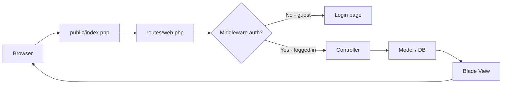
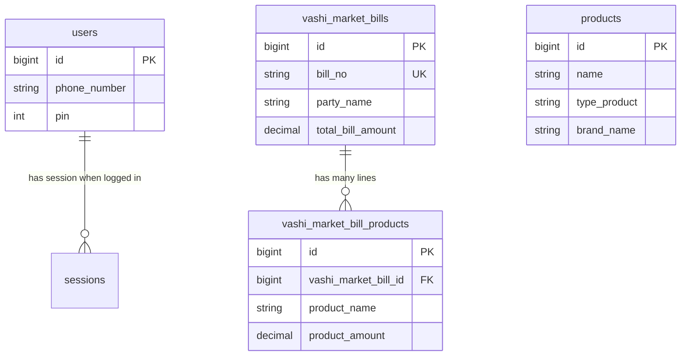
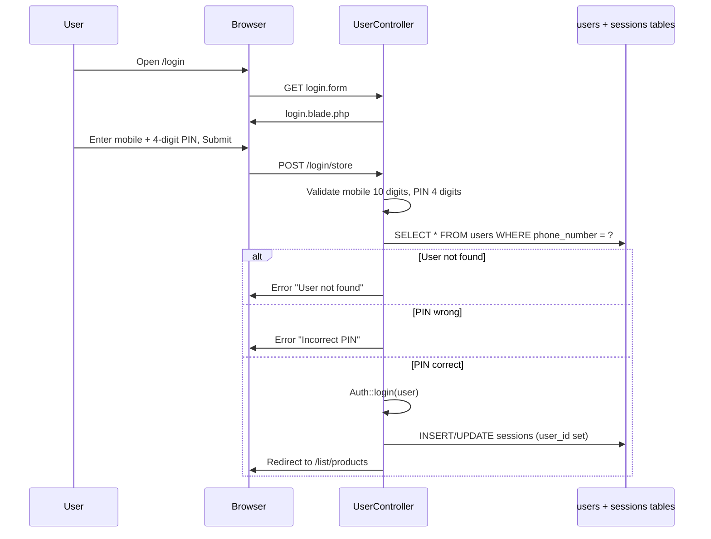
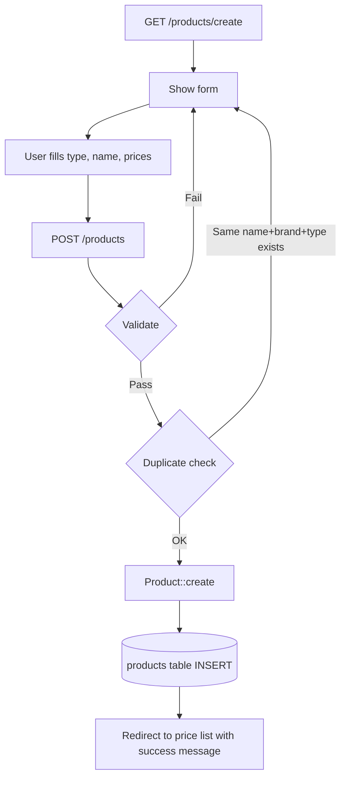
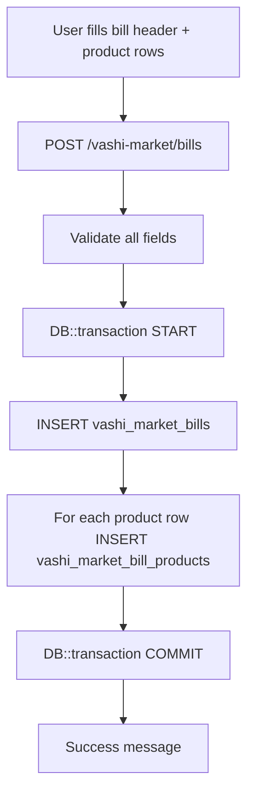
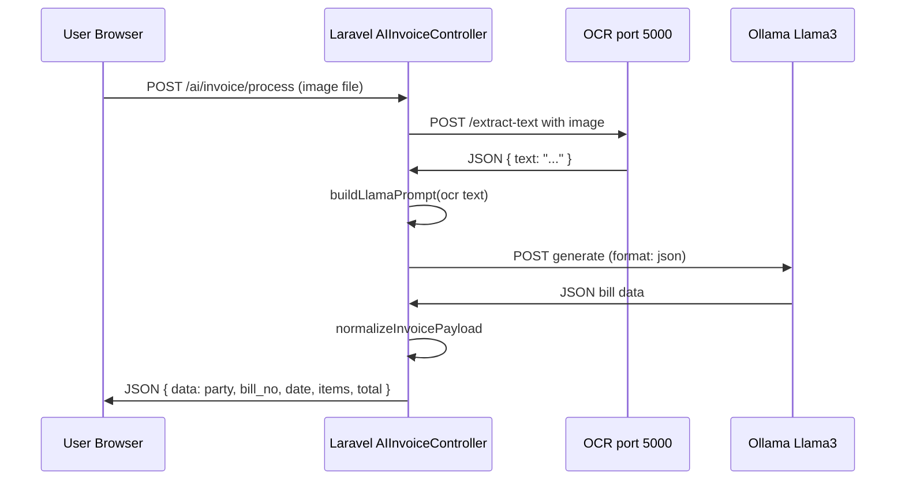

# Sn_Inventory — Project Flow (Step by Step)

This document explains **how the whole project works** in simple words: what each part does, how data moves from screen to database, and how tables are connected.

**Business name in the app:** Sandip Oil Depo General Store (Santosh Tea Center inventory system)

**Database name:** `sn_inventory` (MySQL on XAMPP)

> Table structures below were read **directly from the live MySQL database** (`DESCRIBE` + foreign keys), not only from migration files. Some columns were added manually in phpMyAdmin and do not exist in Laravel migrations.

---

## 1. What is this project?

This is a **web app for a shop** to manage:

1. **Price List** — grocery, oil, masala, and other products with purchase prices
2. **Vashi Market Bills** — bills from wholesale market (party name, transport, bags, kg, rate, payment info)
3. **AI Invoice Upload** — scan a bill photo, read text with OCR, structure it with AI, then save as a Vashi Market bill

Only **logged-in users** can use the main features. Login uses **mobile number + 4-digit PIN**.

---

## 2. Technology used (simple list)

| Part | What it is |
|------|------------|
| **Laravel 12** | PHP framework — handles routes, database, sessions |
| **PHP 8.2+** | Server language |
| **MySQL** | Database (`sn_inventory`) |
| **Blade** | HTML templates in `resources/views/` |
| **Bootstrap 5 + jQuery** | Page design and small UI scripts |
| **Session auth** | Laravel `Auth::login()` — user stays logged in via `sessions` table |
| **PaddleOCR** (external) | Python service on port 5000 — reads text from bill image |
| **Ollama + Llama3** (external) | Local AI on port 11434 — converts OCR text to structured JSON |

---

## 3. Project folder structure (what lives where)

```
Sn_Inventory/
├── app/
│   ├── Http/Controllers/     ← Main logic (login, products, bills, AI)
│   ├── Http/Middleware/      ← Old custom auth (AuthCheck) — not used in routes now
│   └── Models/               ← PHP classes that talk to DB tables
├── bootstrap/app.php         ← App startup, guest redirect config
├── config/                   ← Database, session, AI service URLs
├── database/migrations/      ← Some tables created here (not all columns!)
├── public/                   ← Web entry point (index.php), CSS, JS
├── resources/views/          ← Blade pages (admin screens)
├── routes/web.php            ← All URLs and which controller handles them
└── .env                      ← DB password, OCR URL, Ollama URL, etc.
```

**Important:** When you open the site in browser, every request goes to `public/index.php` → Laravel → `routes/web.php` → Controller → Model → Database → View (HTML back to browser).

---

## 4. How one HTTP request flows (big picture)



**Step by step:**

1. User opens a URL (example: `/list/products`)
2. Apache/XAMPP sends request to `public/index.php`
3. Laravel loads `routes/web.php` and finds the matching route
4. If route needs `auth` middleware and user is not logged in → redirect to `/login`
5. Controller method runs (example: `UserController@showlistofPrice`)
6. Controller reads/writes database using **Models** (`Product`, `VashiMarketBill`, etc.)
7. Controller returns a **Blade view** (HTML page)
8. Browser shows the page

---

## 5. All database tables (from live DB)

### 5.1 Business tables (your shop data)

These are the tables the app actually uses for daily work.

---

#### Table: `users` — who can log in

| Column | Type | Meaning |
|--------|------|---------|
| `id` | bigint, PK | Unique user ID |
| `name` | varchar(255) | Person name |
| `phone_number` | varchar(225) | **10-digit mobile** — used at login |
| `pin` | int(11) | **4-digit PIN** — checked at login (stored as number) |
| `role` | varchar(255) | User role (example: admin) — added manually in DB |
| `email` | varchar(255), unique | Email (Laravel default column) |
| `email_verified_at` | timestamp, nullable | Laravel email verify |
| `password` | varchar(255) | Laravel password field (login does **not** use this) |
| `remember_token` | varchar(100), nullable | Laravel remember me |
| `created_at`, `updated_at` | timestamp | When row was created/updated |

**Note:** `phone_number`, `pin`, and `role` were **added manually** in the database. The default Laravel `users` migration only has `name`, `email`, `password`.

**Connected to:** `sessions.user_id` (when user logs in, session row stores their `id`)

---

#### Table: `products` — master price list

| Column | Type | Meaning |
|--------|------|---------|
| `id` | bigint, PK | Product ID |
| `name` | varchar(100) | Product name |
| `brand_name` | varchar(255), nullable | Brand (mainly for **oil** products) — **manual column** |
| `purchase_price` | decimal(10,2), nullable | Price for grocery/masala/other (one price per product) |
| `type_product` | varchar(255), nullable | Category: `grocery`, `oil`, `masala`, or `other` |
| `size_750ml` | varchar(255), nullable | Oil price for 750ml pack |
| `size_1L` | varchar(255), nullable | Oil price for 1L |
| `size_3L` | varchar(255), nullable | Oil price for 3L |
| `size_5L` | varchar(255), nullable | Oil price for 5L |
| `size_15L_tin` | varchar(255), nullable | Oil price for 15L tin |
| `size_15L_jar` | varchar(255), nullable | Oil price for 15L jar |
| `created_at`, `updated_at` | timestamp | Timestamps |

**How it is used:**

- **Oil** products: prices stored in size columns (`size_750ml`, `size_1L`, etc.), grouped by `brand_name` on the price list page
- **Grocery / Masala / Other**: use `purchase_price` only

**Not connected** to Vashi Market bill lines. Bill products are free text, not linked by foreign key.

---

#### Table: `vashi_market_bills` — one wholesale bill (header)

| Column | Type | Meaning |
|--------|------|---------|
| `id` | bigint, PK | Bill ID |
| `bill_date` | date | Date printed on the bill |
| `received_date` | date | Date goods were received |
| `bill_no` | varchar(255), **unique** | Supplier bill number — must not duplicate |
| `party_name` | varchar(255) | Seller / party who issued the bill |
| `dalal` | varchar(255) | Broker name |
| `transport_name` | varchar(255) | Transport company |
| `total_bill_amount` | decimal(10,2) | Total bill amount |
| `is_paid` | tinyint(1), default 0 | 1 = paid, 0 = not paid |
| `payment_type` | varchar(255), nullable | Cash, UPI, cheque, etc. |
| `transaction_id` | varchar(255), nullable | UPI / bank reference |
| `cheque_no` | varchar(255), nullable | Cheque number |
| `receipt_no` | varchar(255), nullable | Receipt number |
| `paid_date` | date, nullable | When payment was made |
| `paid_amount` | decimal(10,2), nullable | How much was paid |
| `created_at`, `updated_at` | timestamp | Timestamps |

**Indexes in DB:** `bill_date`, `party_name`, unique on `bill_no`

**Connected to:** many rows in `vashi_market_bill_products` (one bill → many product lines)

---

#### Table: `vashi_market_bill_products` — items on one bill (lines)

| Column | Type | Meaning |
|--------|------|---------|
| `id` | bigint, PK | Line item ID |
| `vashi_market_bill_id` | bigint, FK | Points to `vashi_market_bills.id` |
| `product_name` | varchar(255) | Item name from bill (text, not product catalog ID) |
| `brand_name` | varchar(255), nullable | Brand on bill |
| `num_bags` | int(11) | Number of bags |
| `bag_size` | decimal(8,2) | Kg per bag (example: 30 kg) |
| `total_kg` | decimal(8,2) | Total weight in kg |
| `rate` | decimal(8,2) | Rate per kg |
| `product_amount` | decimal(10,2) | Line total amount |
| `created_at`, `updated_at` | timestamp | Timestamps |

**Foreign key:**

```
vashi_market_bill_products.vashi_market_bill_id  →  vashi_market_bills.id
ON DELETE CASCADE  (if bill is deleted, all its lines are deleted too)
```

---

### 5.2 Laravel system tables (framework support)

These tables support login, cache, and queues. You usually do not edit them by hand.

| Table | Purpose |
|-------|---------|
| `sessions` | Stores login session (`user_id`, payload, last_activity) — `SESSION_DRIVER=database` in `.env` |
| `password_reset_tokens` | Password reset (not used for PIN login) |
| `cache` / `cache_locks` | Database cache (`CACHE_STORE=database`) |
| `jobs` / `job_batches` / `failed_jobs` | Background queue (`QUEUE_CONNECTION=database`) |
| `migrations` | List of which Laravel migrations already ran |

#### `sessions` (important for login)

| Column | Type | Meaning |
|--------|------|---------|
| `id` | varchar(255), PK | Session ID (cookie) |
| `user_id` | bigint, nullable | Logged-in user's `users.id` |
| `ip_address` | varchar(45) | User IP |
| `user_agent` | text | Browser info |
| `payload` | longtext | Session data |
| `last_activity` | int(11) | Unix time — used for session expiry |

---

## 6. Table relationships (how data connects)



**Simple rules:**

| From | To | Relationship |
|------|-----|--------------|
| `vashi_market_bills` | `vashi_market_bill_products` | **One bill → many product lines** |
| `vashi_market_bill_products` | `vashi_market_bills` | **Each line belongs to one bill** |
| `users` | `sessions` | **One user can have active session** |
| `products` | (nothing) | **Standalone catalog** — no link to bills |
| `users` | bills/products | **No link** — bills do not store which user created them |

---

## 7. Models (PHP ↔ database mapping)

| Model file | Database table | Main relationships |
|------------|----------------|-------------------|
| `app/Models/User.php` | `users` | Used by Laravel Auth |
| `app/Models/Product.php` | `products` | No relations defined |
| `app/Models/VashiMarketBill.php` | `vashi_market_bills` | `hasMany(VashiMarketBillProduct)` |
| `app/Models/VashiMarketBillProduct.php` | `vashi_market_bill_products` | `belongsTo(VashiMarketBill)` |

**Eloquent example (how code loads a bill with items):**

```php
VashiMarketBill::with('products')->find($id);
// Reads vashi_market_bills row + all vashi_market_bill_products where vashi_market_bill_id = id
```

---

## 8. Routes — every URL in the app

### Guest routes (not logged in)

| Method | URL | Route name | Controller | What happens |
|--------|-----|------------|------------|--------------|
| GET | `/` | — | closure | Redirect to login |
| GET | `/login` | `login.form` | `UserController@showLoginForm` | Show login page |
| POST | `/login/store` | `login.store` | `UserController@loginStore` | Check mobile + PIN, log in |

### Protected routes (must be logged in — `auth` middleware)

| Method | URL | Route name | Controller | What happens |
|--------|-----|------------|------------|--------------|
| GET | `/list/products` | `admin.listofPrice` | `UserController@showlistofPrice` | Price list home |
| GET | `/logout` | `logout` | `UserController@logout` | Log out |
| GET | `/products/create` | `admin.product.create` | `ProductListController@create` | Add product form |
| POST | `/products` | `admin.product.store` | `ProductListController@store` | Save new product |
| GET | `/products/{id}/edit` | `admin.product.edit` | `ProductListController@edit` | Edit product form |
| PUT | `/products/{id}` | `admin.product.update` | `ProductListController@update` | Update product |
| GET | `/vashi-market/bills` | `vashi-market.index` | `VashiMarketController@index` | List all bills |
| GET | `/vashi-market/bills/create` | `vashi-market.create` | `VashiMarketController@create` | New bill form |
| POST | `/vashi-market/bills` | `vashi-market.store` | `VashiMarketController@store` | Save new bill |
| GET | `/vashi-market/{id}/edit` | `vashi-market.edit` | `VashiMarketController@editVashiBill` | Edit bill form |
| PUT | `/vashi-market/{id}` | `vashi-market.update` | `VashiMarketController@updateVashiBill` | Update bill |
| GET | `/vashi-market/details/{id}` | `vashi-market.showBillDetails` | `VashiMarketController@showBillDetails` | View one bill |
| GET | `/vashi-market/{id}/payment` | `vashi-market.payment.form` | `VashiMarketController@showPaymentForm` | **Empty stub — not implemented** |
| GET | `/ai/invoice` | `ai.invoice.upload` | `AIInvoiceController@index` | AI upload page |
| POST | `/ai/invoice/process` | `ai.invoice.process` | `AIInvoiceController@process` | Scan image (OCR + AI) |
| POST | `/ai/invoice/save` | `ai.invoice.save` | `AIInvoiceController@save` | Save AI result to DB |

---

## 9. Login flow (step by step)



**Detailed steps:**

1. User opens `/login` → sees `resources/views/admin/login.blade.php`
2. User types **10-digit mobile** and **4 separate PIN boxes** (JavaScript joins them into one hidden `pin` field)
3. Form POSTs to `/login/store`
4. `UserController@loginStore` validates input
5. Looks up: `User::where('phone_number', $mobileNumber)->first()`
6. Compares `$user->pin == $pins` (plain comparison, not hashed)
7. On success: `Auth::login($user)` and `$request->session()->regenerate()`
8. Laravel writes session row in `sessions` table with `user_id`
9. Redirect to **Price List** (`/list/products`)

**Logout:**

1. `GET /logout`
2. `Auth::logout()` → clears auth
3. `$request->session()->invalidate()` → deletes session
4. Redirect back to login

**Session lifetime:** `.env` has `SESSION_LIFETIME=120` (120 minutes). After that, user must log in again.

---

## 10. Price List module (home page after login)

**URL:** `/list/products`  
**View:** `resources/views/admin/listofPrice.blade.php`  
**Controller:** `UserController@showlistofPrice`

### Data flow

```
Database (products table)
    ↓
Product::where('type_product', 'oil')->get()->groupBy('brand_name')
Product::where('type_product', 'grocery')->get()
Product::where('type_product', 'masala')->get()
Product::where('type_product', 'other')->get()
    ↓
Blade view shows 4 tabs: Grocery | Oil | Masala | Other
```

### Step by step

1. User lands on price list after login
2. Controller loads all products from `products` table
3. Splits them by `type_product` field
4. Oil products are **grouped by brand_name** (so same brand shows together)
5. Page shows tables with prices
6. User can **search** products (JavaScript on page)
7. **Add Product** button goes to `/products/create`

### Product types and which columns matter

| type_product | Columns used on screen |
|--------------|------------------------|
| `oil` | `name`, `brand_name`, `size_750ml`, `size_1L`, `size_5L`, `size_15L_tin`, `size_15L_jar` |
| `grocery` | `name`, `purchase_price` |
| `masala` | `name`, `purchase_price` |
| `other` | `name`, `purchase_price` |

---

## 11. Add / Edit Product flow

**Files:**

- Form view: `resources/views/admin/addProduct.blade.php`
- Controller: `app/Http/Controllers/ProductListController.php`
- Model: `app/Models/Product.php`

### Add product (CREATE)



**Step by step:**

1. User clicks **Add Product** → `GET /products/create`
2. Form shows different fields based on product type (oil vs others)
3. User submits → `POST /products`
4. Controller validates:
   - `type_product` must be: grocery, oil, masala, or other
   - `name` required
   - If oil: optional brand + size price fields
   - If not oil: `purchase_price` required
5. Checks duplicate: same `name` + `brand_name` + `type_product` cannot exist twice
6. `Product::create($validatedData)` → **INSERT into `products`**
7. Redirect to price list with success flash message

### Edit product (UPDATE)

1. User clicks edit on a product → `GET /products/{id}/edit`
2. Same form loads with existing values
3. User submits → `PUT /products/{id}` (form uses `_method=PUT`)
4. Controller validates same rules
5. `$product->update($validatedData)` → **UPDATE `products` row**
6. Redirect to price list

---

## 12. Vashi Market Bills module (full flow)

This module records **wholesale purchase bills** from Vashi market (or similar).

### 12.1 List bills

**URL:** `GET /vashi-market/bills`  
**View:** `resources/views/admin/vashiMarketBillList.blade.php`

**Data flow:**

```
vashi_market_bills  ←──  vashi_market_bill_products (eager loaded)
        ↓
VashiMarketBill::with('products')->latest()
        ↓
Optional filters: search, start_date, end_date
        ↓
Show table of bills
```

**Search** matches: `party_name`, `bill_no`, `bill_date`, or any related `product_name`

---

### 12.2 Create bill manually

**URL:** `GET /vashi-market/bills/create` → form  
**Submit:** `POST /vashi-market/bills`  
**View:** `resources/views/admin/addVashiMarketBill.blade.php`



**Header fields saved to `vashi_market_bills`:**

- `bill_date`, `received_date`, `bill_no`, `party_name`, `dalal`, `transport_name`, `total_bill_amount`
- Payment: `is_paid`, `payment_type`, `transaction_id`, `cheque_no`, `receipt_no`, `paid_date`, `paid_amount`

**Each product row saved to `vashi_market_bill_products`:**

- `product_name`, `brand_name`, `num_bags`, `bag_size`, `total_kg`, `rate`, `product_amount`
- `vashi_market_bill_id` = new bill's `id` (set automatically by Laravel relation)

**Important:** `bill_no` must be **unique** across all bills.

---

### 12.3 View bill details

**URL:** `GET /vashi-market/details/{id}`  
**View:** `resources/views/admin/showVashiMarketBill.blade.php`

1. Laravel finds bill by ID (route model binding)
2. Loads related products: `$vashiMarketBill->load('products')`
3. Shows header + payment status + line items table
4. Links to edit bill

---

### 12.4 Edit bill

**URL:** `GET /vashi-market/{id}/edit` → `PUT /vashi-market/{id}`  
**View:** `resources/views/admin/editVashiBill.blade.php`

**Update strategy (important):**

1. Start database transaction
2. **UPDATE** `vashi_market_bills` row (header + payment fields)
3. **DELETE all old lines:** `$bill->products()->delete()`
4. **INSERT new lines** from form (same as create)
5. Commit transaction
6. Redirect to bill details page

So editing a bill **replaces all product lines** — it does not update line-by-line.

---

### 12.5 Payment route (not finished)

- Route exists: `GET /vashi-market/{id}/payment`
- Controller method `showPaymentForm` is **empty** (commented out)
- Payment fields are edited inside **create** and **edit** bill forms instead
- There is **no separate POST** route for payment-only updates

---

## 13. AI Invoice Upload flow (OCR + Ollama)

**Page:** `GET /ai/invoice` → `resources/views/admin/aiInvoiceUpload.blade.php`  
**Controller:** `app/Http/Controllers/AIInvoiceController.php`

This feature needs **two external services running**:

| Service | URL (.env) | What it does |
|---------|------------|--------------|
| PaddleOCR | `OCR_SERVICE_URL=http://127.0.0.1:5000` | `POST /extract-text` — image → raw text |
| Ollama | `OLLAMA_URL=http://127.0.0.1:11434/api/generate` | Raw text → structured JSON |

### Phase 1 — Scan (process)



**Step by step (scan):**

1. User selects invoice **image** (max 15 MB)
2. Clicks **Scan Invoice** → JavaScript POSTs to `/ai/invoice/process`
3. Laravel sends image to OCR service (`/extract-text`)
4. OCR returns plain text from the bill
5. Laravel builds a long **prompt** telling Llama3 exactly what JSON to return
6. Prompt rules include:
   - `party_name` = **seller** on bill (not your shop name)
   - Your shop names are blocked via `AI_INVOICE_BUYER_ALIASES` in `.env`
   - Items: bags, quantity (kg), rate per kg, amount per line
7. Ollama returns JSON string
8. Laravel parses and cleans the JSON (`normalizeInvoicePayload`)
9. JSON sent back to browser → form fields filled for user to **review and edit**

**Nothing is saved to database yet** until user clicks Confirm.

### Phase 2 — Save (confirm)

**URL:** `POST /ai/invoice/save`

**Step by step (save):**

1. User reviews/edits party name, bill no, date, items, total
2. Clicks **Confirm & save**
3. JavaScript POSTs JSON to `/ai/invoice/save`
4. Laravel validates fields
5. Parses date to `Y-m-d` format
6. **DB transaction:**
   - INSERT `vashi_market_bills` with:
     - `dalal` = `-` (placeholder)
     - `transport_name` = `-` (placeholder)
     - `received_date` = same as `bill_date`
   - For each item INSERT `vashi_market_bill_products`:
     - `bag_size` = calculated as `total_kg / num_bags` if bags > 0
7. Returns JSON `{ success: true, redirect: vashi-market list URL }`
8. Browser redirects to bill list

**AI save vs manual create:**

| Field | Manual create form | AI save |
|-------|-------------------|---------|
| dalal | User enters | Always `-` |
| transport_name | User enters | Always `-` |
| Payment fields | Can enter | Not set (defaults) |

---

## 14. Page layout (every admin screen)

All logged-in pages use the same shell:

```
layouts/app.blade.php
├── layouts/head.blade.php      (CSS, meta)
├── layouts/header.blade.php     (top bar, logout)
├── layouts/sidebar.blade.php    (left menu)
└── @yield('content')           (page-specific content)
```

### Sidebar menu items

| Menu label | Route | Status |
|------------|-------|--------|
| Price List | `admin.listofPrice` | Working |
| Vashi Market Bill Details | `vashi-market.index` | Working |
| Upload Invoice (AI) | `ai.invoice.upload` | Working (needs OCR + Ollama) |
| Oil Bill Details | `#` | **Not built yet** (placeholder link) |
| Daily Report | `dailyCollections.html` | **Static HTML** — not Laravel route |
| Settings | `#` | **Not built yet** |

---

## 15. Controllers summary (who does what)

| Controller | Responsibility |
|------------|----------------|
| `UserController` | Login, logout, price list page |
| `ProductListController` | Create and update products in catalog |
| `VashiMarketController` | List, create, edit, view Vashi Market bills |
| `AIInvoiceController` | Scan invoice image, save AI result as bill |

---

## 16. Manual DB changes vs migrations (important)

Some database columns exist in **live DB** but were **not** created by Laravel migrations:

| Table | Manual columns | Migration has them? |
|-------|----------------|---------------------|
| `users` | `phone_number`, `pin`, `role` | No — migration only has name, email, password |
| `products` | `brand_name` | No — added manually in DB |

If you set up a **fresh** database using only `php artisan migrate`, login and some product features may **break** until you add these columns manually or write new migrations.

**Always trust the live DB structure** (section 5 of this document) for this project.

---

## 17. Environment variables that affect flow

| Variable | Purpose |
|----------|---------|
| `DB_DATABASE=sn_inventory` | Database name |
| `DB_USERNAME` / `DB_PASSWORD` | MySQL login |
| `SESSION_DRIVER=database` | Sessions stored in `sessions` table |
| `SESSION_LIFETIME=120` | Minutes before session expires |
| `OCR_SERVICE_URL` | PaddleOCR base URL |
| `OLLAMA_URL` | Ollama API URL |
| `OLLAMA_MODEL=llama3` | Which AI model to use |
| `AI_INVOICE_MAX_EXECUTION=360` | Max seconds for one scan |
| `AI_INVOICE_BUYER_ALIASES` | Shop names AI must NOT use as party_name |

---

## 18. How to run the project locally

1. Start **XAMPP** — Apache + MySQL
2. Database `sn_inventory` must exist with tables (see section 5)
3. Copy `.env.example` to `.env` if needed, set `APP_KEY` (`php artisan key:generate`)
4. Run `composer install` in project folder
5. Open site via XAMPP: `http://localhost/.../Sn_Inventory/public`
   - Or: `php artisan serve` → `http://127.0.0.1:8000`
6. For AI invoice: start OCR on port 5000 and Ollama on port 11434

---

## 19. Complete data flow map (all modules)

```
┌─────────────────────────────────────────────────────────────────┐
│                         USER (Browser)                          │
└─────────────────────────────────────────────────────────────────┘
         │ login              │ products           │ vashi bills
         ▼                    ▼                    ▼
┌──────────────┐    ┌──────────────────┐    ┌─────────────────────┐
│ users        │    │ products         │    │ vashi_market_bills  │
│ sessions     │    │ (price catalog)  │    │        │            │
└──────────────┘    └──────────────────┘    │        ▼            │
                                             │ vashi_market_bill_ │
         │ AI invoice scan                  │ products (lines)   │
         ▼                                    └─────────────────────┘
┌──────────────┐         ┌──────────────┐
│ OCR :5000    │ ──────► │ Ollama :11434│
└──────────────┘         └──────────────┘
         │                        │
         └──────────┬─────────────┘
                    ▼
         AIInvoiceController@save
                    │
                    ▼
         vashi_market_bills + vashi_market_bill_products
```

---

## 20. Quick reference — which table for which screen?

| Screen | Tables read | Tables written |
|--------|-------------|----------------|
| Login | `users` | `sessions` |
| Price List | `products` | — |
| Add/Edit Product | `products` | `products` |
| Vashi Bill List | `vashi_market_bills`, `vashi_market_bill_products` | — |
| Add/Edit Vashi Bill | `vashi_market_bills`, `vashi_market_bill_products` | Both tables |
| View Bill | Both bill tables | — |
| AI Invoice Save | — | Both bill tables |

---

## 21. Files to read when learning the codebase

| If you want to understand… | Read this file |
|----------------------------|----------------|
| All URLs | `routes/web.php` |
| Login logic | `app/Http/Controllers/UserController.php` |
| Product CRUD | `app/Http/Controllers/ProductListController.php` |
| Vashi bills | `app/Http/Controllers/VashiMarketController.php` |
| AI invoice | `app/Http/Controllers/AIInvoiceController.php` |
| DB models | `app/Models/*.php` |
| Price list UI | `resources/views/admin/listofPrice.blade.php` |
| Bill form UI | `resources/views/admin/addVashiMarketBill.blade.php` |
| AI upload UI | `resources/views/admin/aiInvoiceUpload.blade.php` |

---

*Document generated from live database `sn_inventory` and application source code. Last updated: June 2025.*
